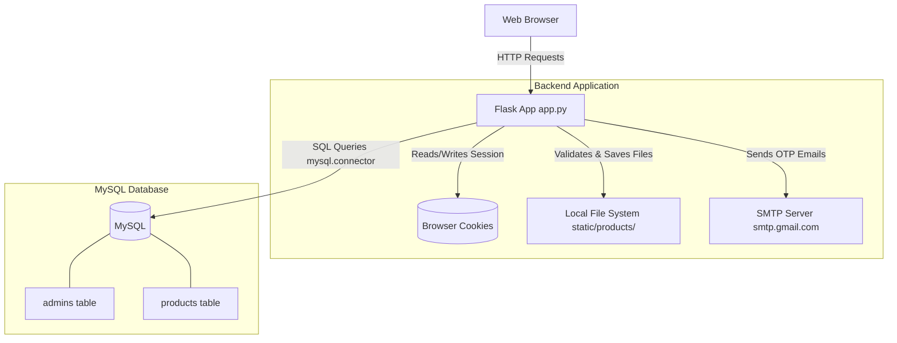

# Application Architecture

This document describes the existing architecture of the E-Commerce Admin Application.

## 1. Folder Structure

The application is structured as a monolithic Flask application primarily contained in a single Python file, supported by templates and static assets.

```text
E-Commerce/
├── app.py                    # Main application logic, routes, and DB setup
├── requirements.txt          # Python dependencies
├── templates/                # Jinja2 HTML templates for the frontend
│   ├── admin_dashboard.html
│   ├── admin_login.html
│   ├── admin_register.html
│   ├── add_product.html
│   ├── products.html
│   ├── product_view.html
│   ├── update_product.html
│   └── verify_otp.html
└── static/                   # Static assets
    ├── uploads/              # General uploads directory
    └── products/             # Uploaded product images
```

## 2. Flask Application Flow

The core application logic resides in `app.py`. The flow is structured as follows:

1. **Initialization**: The Flask app is initialized, and configuration variables are loaded from the environment (using `dotenv`).
2. **Directory Setup**: It ensures that the required static folders (`static/uploads` and `static/products`) exist.
3. **Database Connections**: A helper function `get_db_connection()` creates a fresh `mysql.connector` connection for every incoming HTTP request that requires database access.
4. **Routing**: Standard Flask `@app.route` decorators are used to map URLs to Python functions. Most routes require the user to be authenticated (checked via the `session` object).

## 3. Authentication & OTP Flow

The application implements a custom authentication mechanism:

1. **Registration (`/admin/register`)**:
   - Accepts user details.
   - Hashes the password using `bcrypt`.
   - Generates a 6-digit OTP and calculates an expiration time (5 minutes).
   - Saves the user in the `admins` table with `is_verified = False`.
   - Sends the OTP via email using Python's `smtplib`.
   - Redirects to the OTP verification page.

2. **OTP Verification (`/admin/verify-otp`)**:
   - Verifies the OTP entered by the user against the database.
   - Checks if the OTP has expired.
   - If successful, updates `is_verified = True` and clears the OTP fields.

3. **Login (`/admin/login`)**:
   - Fetches the admin record using the provided email.
   - Ensures `is_verified` is True.
   - Validates the password against the `bcrypt` hash.
   - Stores `admin_id`, `admin_name`, and `admin_email` in the Flask `session`.

## 4. Product Management

Product operations (CRUD) are handled directly in the route functions:
- **Add Product**: Receives form data and an image file, validates the file extension using `allowed_product_image()`, securely saves the file to `static/products`, and inserts the record into MySQL.
- **View Products**: Uses SQL `LIKE` queries to support searching by product name or description and exact matching by category.
- **Update Product**: Updates the text fields in the database for a specific product ID.
- **Delete Product**: Deletes the database record and physically removes the associated image file from the disk using `os.remove()`.

## 5. Architecture Diagram


